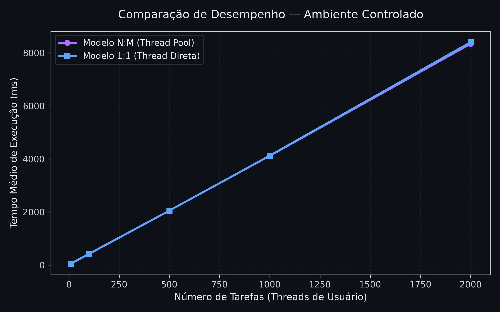
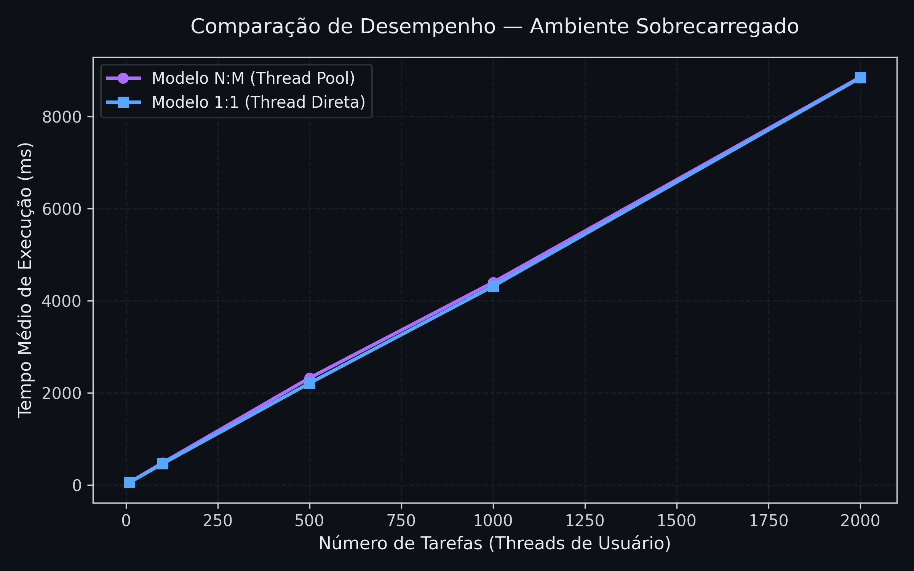

# Comparação de Desempenho entre Modelos de Threads N:M e 1:1 em Java

O objetivo deste experimento foi compreender o impacto do modelo de mapeamento de threads na eficiência de execução de tarefas concorrentes, comparando dois paradigmas distintos: **1:1** e **N:M**.

No modelo **1:1**, cada thread de usuário é mapeada diretamente para uma thread do sistema operacional, permitindo execução paralela real e controle total pelo escalonador do sistema.  
No modelo **N:M**, múltiplas threads de usuário são multiplexadas sobre um número menor de threads do sistema (M), reduzindo o custo de criação e o overhead de troca de contexto, ao custo de menor granularidade de paralelismo.

Como o Java utiliza nativamente o modelo 1:1, o modelo N:M foi simulado por meio de um **pool fixo de threads** (`ExecutorService`) com tamanho M=12, sobre o qual foram distribuídas múltiplas tarefas de usuário (N variando entre 10 e 2000).  
O desempenho foi avaliado pelo **tempo total de execução** das tarefas em diferentes condições de carga do sistema.

Os testes foram realizados na mesma máquina, em dois cenários distintos:

- **Execução leve:** apenas o IntelliJ IDEA aberto, com mínima interferência do sistema.  
- **Execução sobrecarregada:** execução simultânea de Photoshop, Discord, VS Code, Spotify (música tocando), Google Chrome (com vídeo no YouTube e várias abas), IntelliJ e Steam.

O número de núcleos lógicos disponíveis era **12**, valor usado como tamanho fixo do pool (M=12) no modelo N:M.

Cada thread executou uma carga **CPU-bound**, realizando 1.000.000 iterações de operações trigonométricas simples (`sin` e `tan`), garantindo uso real da CPU e evitando otimizações triviais pelo compilador JIT.

As execuções foram feitas para **N = 10, 100, 500, 1000 e 2000** tarefas, em ambos os modelos.  
Cada configuração foi repetida **três vezes**, e o tempo total de execução foi medido em milissegundos com `System.nanoTime()`.

---

## Resultados

### Execução com Baixa Carga

### Execução com Alta Carga

Durante a execução em ambiente leve, o desempenho dos modelos **N:M** e **1:1** foi praticamente idêntico, com variações inferiores a 1%.  
Com o sistema sobrecarregado, observou-se um aumento geral no tempo de execução (cerca de 5% a 15%), sendo o modelo N:M ligeiramente mais afetado.

---

## 4. Análise e Discussão

Os resultados indicam que, sob carga computacional intensiva e com o número de threads próximo ao número de núcleos, **ambos os modelos apresentam desempenho equivalente**.

O modelo **1:1** é naturalmente favorecido quando há recursos disponíveis, pois o escalonador do sistema pode gerenciar cada thread de forma independente. Entretanto, ele tem maior custo de criação e gerenciamento de threads, o que se torna relevante apenas quando o número de threads cresce de forma exponencial.

O modelo **N:M**, com um pool fixo de threads, mostrou-se eficiente até valores moderados de N (até 500), com diferenças mínimas de desempenho.  
Sob forte sobrecarga, o modelo N:M foi ligeiramente mais sensível, provavelmente por depender do gerenciamento de filas internas do `ExecutorService`, que adiciona sobrecarga de coordenação e disputa de bloqueios internos.

Quando N se aproxima de 2000, ambos os modelos atingem o limite de paralelismo físico (12 núcleos), passando a depender fortemente de **trocas de contexto**. Nesse ponto, o tempo de execução cresce quase linearmente com o número de tarefas, refletindo o limite de throughput da CPU, e não do modelo de threads em si.

A segunda execução também demonstra a interferência de **concorrência externa**: múltiplos processos competindo por CPU provocam aumento de tempo mesmo sem alterar o código. Isso evidencia a importância de conduzir experimentos de desempenho em **ambientes controlados e isolados**.

---

## 5. Conclusões

A partir dos resultados obtidos, é possível concluir que:

- Em condições controladas, os modelos **N:M** e **1:1** apresentaram desempenho quase idêntico para tarefas CPU-bound.  
- Sob carga externa, o modelo **1:1** manteve desempenho mais estável, enquanto o **N:M** apresentou leve aumento no tempo de execução.  
- À medida que o número de threads excede o número de núcleos disponíveis, o ganho de paralelismo desaparece e o tempo de execução passa a crescer proporcionalmente.  
- O modelo **N:M** é mais vantajoso em cenários com **muitas tarefas leves e de I/O**, enquanto o **1:1** é preferível em tarefas **intensivas em CPU**, nas quais o número de threads pode ser alinhado com os núcleos do processador.

---

## 6. Considerações Finais

O experimento atingiu seu objetivo principal: compreender como diferentes modelos de mapeamento de threads influenciam o desempenho em ambientes concorrentes.

Os resultados demonstram que, para cargas CPU-bound e moderadas, o modelo **1:1** oferece previsibilidade e robustez sob diferentes condições de carga.  
Já o modelo **N:M** representa uma abordagem eficiente e escalável quando o número de tarefas de usuário é muito superior à capacidade de threads do sistema, especialmente em contextos I/O-bound.

Em suma, o comportamento observado reforça a importância de escolher o modelo de concorrência mais adequado ao tipo de carga e ao ambiente de execução, considerando tanto a natureza da tarefa quanto a disponibilidade real de recursos de hardware.

---

### Referências

- Tanenbaum, A. S. *Sistemas Operacionais Modernos.* Pearson.  
- Silberschatz, A., Galvin, P. B., & Gagne, G. *Operating System Concepts.* Wiley.  
- Documentação oficial da Oracle: [Java Concurrency](https://docs.oracle.com/javase/8/docs/api/java/util/concurrent/package-summary.html)
